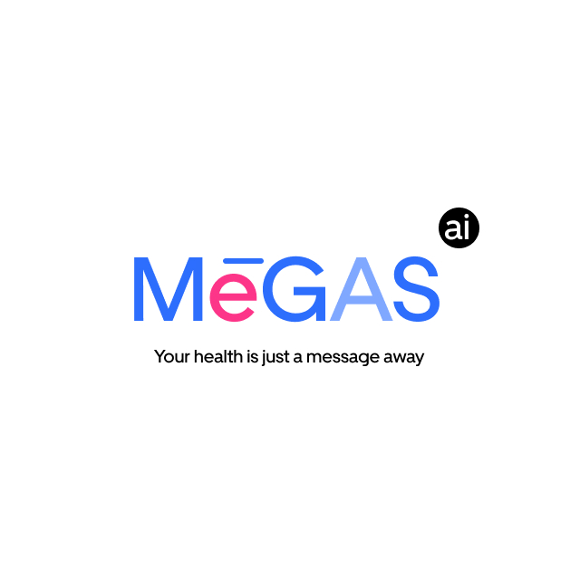

# MEGASAI - Digital Sexual Health Assistant

<div align="center">



<br>

[](http://creativecommons.org/publicdomain/zero/1.0/)
[](https://sdgs.un.org/goals/goal3)
[](https://www.unicef.org/digitalimpact/)

**🏆 UNICEF Digital Innovation Awards 2024 - 2nd Runner Up**

</div>

## 📋 Table of Contents

- [Overview](#overview)
- [SDG Relevance](#sdg-relevance)
- [Key Features](#key-features)
- [Technical Architecture](#technical-architecture)
- [Installation & Deployment](#installation--deployment)
- [Usage](#usage)
- [Data & Privacy](#data--privacy)
- [Safety & Content Moderation](#safety--content-moderation)
- [Contributing](#contributing)
- [License](#license)
- [Team](#team)
- [Contact](#contact)

## 🌟 Overview

MEGASAI is an innovative digital public good that provides AI-driven sexual health education and support through chat platforms. Designed to address the critical gap in accessible sexual health information, particularly for youth aged 15-49, MEGASAI leverages conversational AI to provide timely, confidential, and medically accurate sexual health guidance.

**🏢 Ownership**: MEGASAI belongs to **TEAM MEGAS** and is developed as a public health initiative.

**🎓 Sponsorship**: This project is proudly sponsored by **The Central Leadership Program**.

### The Problem We Solve

- **1 million+ new STI cases** reported daily worldwide
- **Critical 24-hour intervention window** for effective treatment
- **Stigma and embarrassment** preventing healthcare access
- **Misinformation** from unverified sources
- **Self-medication risks** without professional oversight

### Our Solution

MEGASAI provides:
- 🏥 **Chat-A-Doctor**: Direct consultation with healthcare professionals
- ❓ **Ask-A-Question**: Quick responses to sexual health queries
- ⚡ **Fast Care**: Rapid response system for urgent concerns
- 🔒 **Confidential**: Safe, judgment-free environment
- 🌍 **Accessible**: Available via Telegram and WhatsApp

## 🎯 SDG Relevance

MEGASAI directly contributes to multiple Sustainable Development Goals:

### Primary SDG Alignment

**🎯 SDG 3: Good Health and Well-being**
- **Target 3.3**: Combat communicable diseases, including sexually transmitted infections
- **Target 3.7**: Ensure universal access to sexual and reproductive health-care services
- **Target 3.8**: Achieve universal health coverage and access to essential healthcare services

### Secondary SDG Contributions

**🎯 SDG 4: Quality Education**
- **Target 4.7**: Ensure comprehensive education on sexual and reproductive health

**🎯 SDG 5: Gender Equality**
- **Target 5.6**: Ensure universal access to sexual and reproductive health and reproductive rights

**🎯 SDG 10: Reduced Inequalities**
- **Target 10.3**: Ensure equal opportunity and reduce inequalities in health access

**🎯 SDG 16: Peace, Justice and Strong Institutions**
- **Target 16.6**: Develop effective, accountable and transparent institutions at all levels

## ✨ Key Features

### Core Functionality
- **Multi-Platform Support**: Telegram, WhatsApp, and web-based interfaces
- **AI-Powered Responses**: Contextual understanding of sexual health queries
- **Professional Network**: Integration with verified healthcare providers
- **Multilingual Support**: Currently available in English with expansion plans
- **24/7 Availability**: Round-the-clock access to health information

### Advanced Capabilities
- **Triage System**: Automated assessment of urgency levels
- **Resource Library**: Comprehensive database of sexual health information
- **Referral Network**: Connection to local healthcare facilities
- **Anonymous Consultations**: No registration required for basic queries
- **Crisis Intervention**: Specialized responses for urgent situations

## 🏗️ Technical Architecture

### Platform
- **Framework**: Botpress (Open Source Conversational AI Platform)
- **License**: CC0 1.0 Universal (Public Domain)
- **Deployment**: Cloud-native with Docker support
- **APIs**: RESTful API for integration with healthcare systems

### Technology Stack
- **Backend**: Node.js
- **Database**: PostgreSQL (for data) / JSON (for configurations)
- **AI/ML**: Natural Language Processing for intent recognition
- **Messaging**: Telegram Bot API, WhatsApp Business API
- **Security**: End-to-end encryption, GDPR compliant

### 🤖 Open Source AI Training Data

**📊 HuggingFace Dataset**: [`oMarquess/nahara-dataset-2010n`](https://huggingface.co/datasets/oMarquess/nahara-dataset-2010n)

MEGASAI provides open-sourced training data specifically curated for sexual health education:

- **Fine-tuning Ready**: Pre-processed dataset optimized for medical chatbot training
- **RAG Compatible**: Structured for Retrieval-Augmented Generation implementations
- **Custom Models**: Support for any LLM framework (OpenAI, Anthropic, Hugging Face, etc.)
- **Medical Accuracy**: Clinically reviewed conversation patterns and responses
- **Multilingual Support**: Training data includes English and Pidgin English conversations
- **Format**: Parquet files for easy integration with ML pipelines

**🔧 Usage for Developers**:
```python
# Example: Loading MEGASAI dataset for fine-tuning
from datasets import load_dataset

dataset = load_dataset("oMarquess/nahara-dataset-2010n")
# Ready for your custom sexual health chatbot training
```

**🎯 Applications**:
- Train custom medical assistants
- Enhance existing healthcare chatbots
- Research in conversational AI for health
- Educational tool development for medical training

### Data Architecture
```
MEGASAI/
├── bot.json              # Main bot configuration
├── files/                # Media and document storage
├── tables/              # Database schemas and data
├── cloud_files.json     # File metadata
├── documents.json       # Document indexing
└── files.json          # File management
```

## 🚀 Installation & Deployment

### 🎯 Fastest Method: Botpress Cloud Upload (Recommended)

**⚡ One-click deployment - Perfect for testing and evaluation:**

1. **Go to [Botpress Cloud](https://botpress.com/)** and create a free account
2. **Create a new bot** or select existing workspace
3. **Upload the .bpz file**:
   - Go to Settings → Import/Export
   - Click "Import from file"
   - Upload `archives/DPG-Entry-MEGASAI.bpz`
   - Wait for import to complete (2-3 minutes)
4. **Configure messaging channels**:
   - Add your Telegram bot token
   - Add your WhatsApp API credentials
5. **Test immediately** - Your bot is live!

**⏱️ Total time: 5 minutes** | **💰 Cost: Free** | **🔧 Technical skills: None required**

---

### 🐳 Self-Hosted Deployment

#### Prerequisites
- Docker (recommended) or Node.js 16+
- PostgreSQL 12+
- Valid API keys for messaging platforms

#### Quick Start with Docker

```bash
# Clone the repository
git clone https://github.com/oMarquess/megasai
cd megasai

# Extract bot configuration
unzip DPG-Entry-MEGASAI.bpz

# Build and run with Docker
docker-compose up -d

# Import bot configuration to Botpress
# Follow the Botpress documentation for importing bot.json
```

### Manual Installation

```bash
# Install Botpress
npm install -g @botpress/cli

# Create new bot workspace
bp create

# Import MEGASAI configuration
# Copy bot.json and files/ to your Botpress workspace

# Configure environment variables
cp .env.example .env
# Edit .env with your API keys and database credentials

# Start the bot
bp start
```

### Configuration

1. **Messaging Platform Setup**:
   - Telegram: Configure bot token in environment variables
   - WhatsApp: Set up WhatsApp Business API credentials

2. **Database Setup**:
   - Import provided table schemas
   - Configure database connection strings

3. **AI Model Configuration**:
   - Configure NLP models for health-related intent recognition
   - Set up content filtering and safety mechanisms

## 📖 Usage

### For End Users

1. **Telegram**: Search for `@megas_ai_gh_bot` or visit t.me/megas_ai_gh_bot
2. **WhatsApp**: Send a message to +233 50 140 8030
3. **Web**: Visit https://megasai.onepage.me/

### Sample Interactions

```
User: "I think I might have an STI, what should I do?"
MEGASAI: "I understand your concern. Based on symptoms you may be experiencing, I recommend getting tested within 24-48 hours. Would you like me to help you find nearby testing facilities or connect you with a healthcare provider?"

User: "How can I protect myself from HIV?"
MEGASAI: "Great question! Here are the most effective ways to prevent HIV transmission: [provides comprehensive, medically accurate information]"
```

### For Healthcare Providers

Healthcare providers can integrate with MEGASAI to:
- Receive referrals from the bot
- Provide expert responses through the Chat-A-Doctor feature
- Access anonymized usage statistics for public health insights

## 🔒 Data & Privacy

### Data Collection
We collect minimal data necessary for service delivery:
- **Non-PII**: Conversation logs (anonymized), usage patterns, query categories
- **Optional PII**: User-provided contact information for follow-ups (with consent)

### Data Protection Measures
- **Encryption**: All data encrypted in transit and at rest
- **Anonymization**: Personal identifiers removed from analytics data
- **Retention**: Data retained only as long as necessary for service delivery
- **Export**: Users can request their data in JSON/CSV format
- **Deletion**: Users can request complete data deletion

### Compliance
- **GDPR**: Full compliance with European data protection regulations
- **COPPA**: Specialized protections for users under 13
- **HIPAA**: Healthcare data handling in accordance with medical privacy standards
- **Local Laws**: Compliance with relevant domestic privacy laws in operating regions

### Data Export Mechanism
Non-PII data can be exported via:
```bash
# API endpoint for data export
GET /api/v1/export/non-pii
Content-Type: application/json

# Returns anonymized conversation data, usage statistics
```

## 🛡️ Safety & Content Moderation

### Content Safety Framework

**Inappropriate Content Detection**:
- Automated filtering of explicit sexual content
- Real-time detection of harmful misinformation
- Escalation protocols for crisis situations

**User Protection Measures**:
- Anonymous reporting system for harassment
- Automated detection of potential abuse
- Crisis intervention protocols for self-harm indicators
- Age verification for sensitive content

**Professional Oversight**:
- All medical advice reviewed by qualified healthcare professionals
- Regular content auditing and updates
- Continuous monitoring of AI responses for accuracy

### Harassment Protection
- **Blocking System**: Users can block unwanted contacts
- **Reporting**: Easy reporting mechanism for inappropriate behavior
- **Moderation**: 24/7 human moderation team
- **Crisis Response**: Immediate escalation for serious threats

### Underage User Safety
- **Age Verification**: Optional age verification for sensitive topics
- **Parental Controls**: Information for parents and guardians
- **Educational Focus**: Age-appropriate health education
- **Professional Support**: Direct connection to child healthcare specialists

## 🤝 Contributing

We welcome contributions from healthcare professionals, developers, and researchers:

### How to Contribute
1. **Healthcare Content**: Medical professionals can contribute to our knowledge base
2. **Technical Development**: Developers can improve the AI models and platform
3. **Open Source Training**: Use our [HuggingFace dataset](https://huggingface.co/datasets/oMarquess/nahara-dataset-2010n) for your own health chatbot projects
4. **Localization**: Help translate content for different languages and regions
5. **Research**: Collaborate on studies measuring health impact

### Development Guidelines
- Follow our code of conduct
- Ensure all medical content is evidence-based
- Maintain user privacy and safety standards
- Document all changes thoroughly

### Governance
- Open source governance model
- Healthcare advisory board oversight
- Community-driven feature prioritization
- Transparent decision-making process

## 📊 Impact & Metrics

### Current Reach
- **1,000+ active users** within first 8 months
- **Multiple platform deployment**: Telegram and WhatsApp
- **Partnership network**: Collaborations with local health clinics and schools
- **Award recognition**: UNICEF Digital Innovation Awards 2024 (Ghana)

### Measuring Success
- Health outcome improvements
- User satisfaction and engagement
- Healthcare provider adoption
- Reduction in misinformation spread

## 🌍 Partnerships

### Current Partners
- Local health clinics
- Educational institutions
- Community health organizations
- Healthcare provider networks

### Partnership Opportunities
- Healthcare systems integration
- Educational curriculum development
- Research and evaluation studies
- Regional expansion initiatives

## 📜 License

This project is licensed under the **CC0 1.0 Universal (Public Domain)** license - see the [LICENSE](LICENSE) file for details.

### 🏆 Digital Public Goods Compliant License
**CC0 1.0 Universal is the recommended license for Digital Public Goods** - providing maximum accessibility and reuse potential globally.

### What this means:
- ✅ **Commercial use** allowed
- ✅ **Modification** allowed  
- ✅ **Distribution** allowed
- ✅ **Private use** allowed
- ✅ **No attribution required**
- ✅ **Public domain dedication**
- ❌ **No warranty** provided
- ❌ **No liability** assumed

## 👥 Team

### 🏢 TEAM MEGAS

**🚀 Leadership & Coordination**:
- **Redeemer O. Salami** - Founder/AI Engineer
- **Philip Attram, MLS** - Co-Founder
- **John A. Basil, PMP** - Project Manager

**💻 Technical Development**:
- **Felix Coker** - Lead Developer
- **Adase Ishmael, MLS** - Data Analyst

**🏥 Medical & Healthcare Team**:
- **Dr. Rhoda E. Badu, MD** - Medical Team Lead
- **Dr. Denu Edinam** - Pharmacist
- **Cherrylyn Asiwome** - Physician Assistant

**📋 Operations & Management**:
- **Benjamin Ghanney** - Schedule Manager
- **Edna Dorgbefu** - Communications Lead

**🔬 Research & Analysis**:
- **Delali Ahiabor** - Overall Coordinator
- **Kezziah Essandor** - Finance Lead

### 🎓 Sponsorship & Support

**Primary Sponsor**: The Central Leadership Program

---

**📞 Team Contact**: For team-related inquiries, reach out via [teammegas62@gmail.com](mailto:teammegas62@gmail.com)

*Complete team profiles and professional backgrounds available on the [project website](https://megasai.onepage.me/)*

## 📞 Contact

- **Website**: https://megasai.onepage.me/
- **WhatsApp**: +233 50 140 8030
- **Telegram**: @megas_ai_gh_bot
- **Email**: [teammegas62@gmail.com]
- **GitHub**: [https://github.com/oMarquess/megasai]


<div align="center">

**Making sexual health information accessible, confidential, and accurate for everyone.**

[](https://megasai.onepage.me/)
[](https://t.me/megas_ai_gh_bot)
[](https://wa.me/233501408030)

</div>